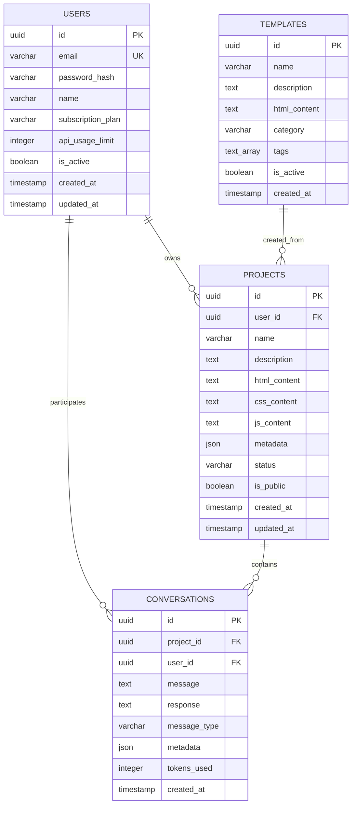

# 🚀 Lovable.dev Clone - AI-Powered Website Builder

A production-ready clone of Lovable.dev that enables users to build websites through natural language conversations with AI, requiring no coding knowledge.


## 📋 Table of Contents

- [Features](#-features)
- [Architecture](#-architecture)
- [Tech Stack](#-tech-stack)
- [Quick Start](#-quick-start)
- [Development](#-development)
- [API Documentation](#-api-documentation)
- [Database Schema](#-database-schema)
- [Deployment](#-deployment)
- [Contributing](#-contributing)

## ✨ Features

### Core Functionality
- 🤖 **AI-Powered Website Generation** - Natural language to complete websites
- 💬 **Conversational Interface** - Intuitive chat-based website building
- 🎨 **Real-time Preview** - Live website preview with instant updates
- 📱 **Responsive Design** - Mobile-first, responsive website generation
- 📦 **Export Functionality** - Download complete websites as ZIP files
- 🎯 **Template Library** - Pre-built templates across multiple categories

### Technical Features
- ⚡ **Real-time Communication** - WebSocket-powered live updates
- 🔐 **Secure Authentication** - JWT-based auth with refresh tokens
- 🚀 **High Performance** - Go backend with efficient caching
- 📊 **Scalable Architecture** - Microservices-ready design
- 🐳 **Containerized Deployment** - Docker Compose for easy deployment
- 📈 **Monitoring & Logging** - Comprehensive health checks and logging

## 🏗️ Architecture

### System Overview


### Backend Architecture

The backend follows a clean architecture pattern with clear separation of concerns:


### Frontend Architecture

Modern React application with component-based architecture:


## 🛠️ Tech Stack

### Backend
- **Runtime**: Go 1.21+
- **Framework**: Gin (HTTP router and middleware)
- **Database**: PostgreSQL 15+ (Primary data store)
- **Cache**: Redis 7+ (Sessions, caching, pub/sub)
- **Authentication**: JWT with refresh tokens
- **WebSockets**: Gorilla WebSocket for real-time communication
- **AI Integration**: Claude API (Anthropic) + OpenAI (fallback)

### Frontend
- **Framework**: React 18+ with TypeScript
- **Routing**: React Router v6
- **Styling**: Tailwind CSS
- **State Management**: Context API + Custom Hooks
- **HTTP Client**: Axios
- **WebSocket**: Socket.io Client
- **Build Tool**: Vite

### DevOps & Infrastructure
- **Containerization**: Docker & Docker Compose
- **Development**: Hot reload with Air (Go) and Vite (React)
- **Database Migrations**: SQL scripts with Docker init
- **Logging**: Structured logging with Logrus
- **Health Checks**: Built-in health endpoints
- **Environment Management**: dotenv configuration

## 🚀 Quick Start

### Prerequisites
- Docker and Docker Compose
- Go 1.21+ (for development)
- Node.js 18+ (for frontend development)
- Claude API key from Anthropic

### 1. Clone the Repository
```bash
git clone https://github.com/akhilsplendid/lovable-go.git
cd lovable-go
```

### 2. Environment Setup
```bash
# Copy environment template
cp .env.example .env

# Add your API keys to .env
CLAUDE_API_KEY=your_claude_api_key_here
OPENAI_API_KEY=your_openai_api_key_here  # Optional fallback
```

### 3. Quick Start with Make
```bash
# Setup development environment
make setup

# Start all services
make quick-start
```

### 4. Manual Docker Setup
```bash
# Start database services
make docker-up

# Start the Go API server
make dev

# In another terminal, start the React frontend
cd frontend
npm install
npm run dev
```

### 5. Access the Application
- **Frontend**: http://localhost:3000
- **Backend API**: http://localhost:3001
- **Health Check**: http://localhost:3001/health

## 💻 Development

### Available Commands

```bash
# Development
make setup          # Setup development environment
make dev            # Start API with hot reload
make build          # Build Go binary
make test           # Run tests

# Docker Management
make docker-up      # Start PostgreSQL and Redis
make docker-down    # Stop all services
make docker-rebuild # Rebuild and restart services
make docker-full    # Start all services including API

# Utilities
make logs           # Show all logs
make logs-api       # Show API logs only
make health         # Check service health
make clean          # Clean build artifacts

# Database
make db-migrate     # Run database migrations
make db-reset       # Reset database
```

### Project Structure

```
lovable-go/
├── cmd/
│   └── server/              # Application entry point
├── internal/
│   ├── api/                 # HTTP handlers
│   ├── config/              # Configuration management
│   ├── middleware/          # HTTP middleware
│   ├── models/              # Data models
│   ├── repository/          # Data access layer
│   ├── services/            # Business logic
│   └── utils/               # Utilities
├── frontend/
│   ├── src/
│   │   ├── components/      # React components
│   │   ├── pages/           # Page components
│   │   ├── services/        # API services
│   │   ├── hooks/           # Custom hooks
│   │   └── utils/           # Frontend utilities
│   └── public/              # Static assets
├── docker-compose.yml       # Service orchestration
├── Dockerfile              # Container definition
├── Makefile               # Development commands
├── init-db.sql           # Database schema
└── README.md             # This file
```

## 📚 API Documentation

### Authentication Endpoints
```
POST /api/auth/register    # User registration
POST /api/auth/login       # User login
POST /api/auth/refresh     # Refresh JWT token
POST /api/auth/logout      # User logout
```

### Project Management
```
GET    /api/projects           # List user projects
POST   /api/projects           # Create new project
GET    /api/projects/:id       # Get project details
PUT    /api/projects/:id       # Update project
DELETE /api/projects/:id       # Delete project
```

### AI Generation
```
POST /api/ai/generate          # Generate website from prompt
POST /api/ai/chat             # Chat with AI about project
GET  /api/ai/templates        # Get available templates
```

### Export & Preview
```
GET /api/export/:id/preview   # Preview generated website
GET /api/export/:id/download  # Download website as ZIP
```

### WebSocket Events
```
connection                    # User connects to project room
generate_website             # Start website generation
generation_progress          # Progress updates
generation_complete          # Generation finished
generation_error             # Generation failed
```

## 🗄️ Database Schema

### Entity Relationship Diagram



### Key Tables

#### Users
- Manages user accounts, authentication, and subscription plans
- Tracks API usage limits and account status

#### Projects
- Stores generated websites (HTML, CSS, JS)
- Maintains project metadata and status
- Links to user ownership and conversations

#### Conversations
- Records all AI interactions for each project
- Tracks token usage and AI provider used
- Enables conversation history and context

#### Templates
- Pre-built website templates by category
- Supports tagging and usage tracking
- Foundation for quick website generation

## 🚀 Deployment

### Production Environment

#### Environment Variables
```bash
# Database
DB_HOST=your_postgres_host
DB_PORT=5432
DB_USER=your_db_user
DB_PASSWORD=your_db_password
DB_NAME=ai_website_builder

# Redis
REDIS_URL=redis://your_redis_host:6379

# API Keys
CLAUDE_API_KEY=your_claude_api_key
OPENAI_API_KEY=your_openai_api_key

# Security
JWT_SECRET=your_super_secret_jwt_key
JWT_REFRESH_SECRET=your_refresh_secret

# Application
NODE_ENV=production
PORT=3001
FRONTEND_URL=https://your-domain.com
```

- **Issues**: [GitHub Issues](https://github.com/akhilsplendid/lovable-go/issues)
- **Discussions**: [GitHub Discussions](https://github.com/akhilsplendid/lovable-go/discussions)
- **Email**: support@lovable-clone.dev

---

**Built with ❤️ by [Akhilesh](https://github.com/akhilsplendid)**

*Making AI-powered website creation accessible to everyone.*
